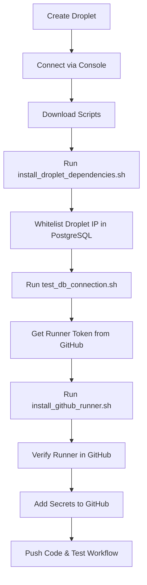

# Droplet Setup Scripts

These scripts automate the setup of your DigitalOcean Droplet for running the Xero sync as a GitHub Actions self-hosted runner.

## Quick Start

### On Your Droplet

After creating your Droplet and connecting via web console or SSH:

```bash
# 1. Download the setup scripts
curl -o setup.tar.gz https://github.com/YOUR_USERNAME/Xero-to-PostgreSQL/archive/main.tar.gz
tar -xzf setup.tar.gz --strip-components=1 "*/scripts"
cd scripts
chmod +x *.sh

# 2. Install dependencies
sudo bash install_droplet_dependencies.sh

# 3. Test database connection
bash test_db_connection.sh

# 4. Install GitHub runner
bash install_github_runner.sh
```

## Scripts Overview

### 1. install_droplet_dependencies.sh

**Purpose:** Installs all required software on your Droplet.

**What it installs:**
- Python 3.11
- pip (Python package manager)
- Git
- curl
- PostgreSQL client

**Usage:**
```bash
sudo bash install_droplet_dependencies.sh
```

**Time:** ~2-3 minutes

---

### 2. test_db_connection.sh

**Purpose:** Verifies your Droplet can connect to DigitalOcean PostgreSQL.

**What it does:**
- Prompts for database connection details
- Tests connection with psql
- Confirms whitelist is working

**Usage:**
```bash
bash test_db_connection.sh
```

**Required information:**
- Database Host (from DO Console)
- Database Port (usually 25060)
- Database Name
- Database User  
- Database Password

**Time:** ~1 minute

---

### 3. fix_and_install_runner.sh

**Purpose:** Fixes root user issue and installs GitHub Actions self-hosted runner properly.

**What it does:**
- Creates non-root 'runner' user (GitHub runners can't run as root)
- Cleans up any previous installation attempts
- Downloads and configures runner as the runner user
- Installs as systemd service
- Starts runner automatically

**Usage:**
```bash
sudo bash fix_and_install_runner.sh
```

**When to use:**
- If you got "Must not run with sudo" error
- If you tried installing as root user
- Fresh installation (recommended method)

**Required information:**
- GitHub username
- Repository name
- Runner token (from GitHub Settings → Actions → Runners)
- Password for the 'runner' user

**Time:** ~3-5 minutes

---

### 4. install_github_runner.sh (Legacy)

**Purpose:** Installs and configures GitHub Actions self-hosted runner.

**Note:** This script assumes you're already running as a non-root user. Use `fix_and_install_runner.sh` instead if you're logged in as root.

**What it does:**
- Downloads GitHub Actions runner
- Configures runner for your repository
- Installs as systemd service
- Starts runner automatically

**Usage:**
```bash
bash install_github_runner.sh
```

**Required information:**
- GitHub username
- Repository name
- Runner token (from GitHub Settings → Actions → Runners)

**Time:** ~3-5 minutes

---

## Manual Installation (Alternative)

If you prefer to copy scripts manually:

### Option 1: Using Git

```bash
# On your Droplet
git clone https://github.com/YOUR_USERNAME/Xero-to-PostgreSQL.git
cd Xero-to-PostgreSQL/scripts
chmod +x *.sh
```

### Option 2: Copy-Paste

1. Open each script file in this folder
2. In your Droplet console, create the file:
   ```bash
   nano install_droplet_dependencies.sh
   ```
3. Paste the contents
4. Save (Ctrl+X, Y, Enter)
5. Make executable:
   ```bash
   chmod +x install_droplet_dependencies.sh
   ```
6. Repeat for other scripts

---

## Common Issues

### "Must not run with sudo" Error

**Problem:** GitHub Actions runners refuse to run as root for security reasons.

**Solution:** Use the `fix_and_install_runner.sh` script which creates a non-root user automatically:
```bash
sudo bash fix_and_install_runner.sh
```

### Script won't run: "Permission denied"

Make scripts executable:
```bash
chmod +x *.sh
```

### "Command not found" errors

Ensure you're running scripts in the correct order:
1. install_droplet_dependencies.sh (installs tools)
2. test_db_connection.sh (requires psql)
3. install_github_runner.sh (requires curl)

### Database connection fails

1. Verify Droplet IP is whitelisted in DO PostgreSQL settings
2. Check connection details are correct
3. Confirm database is running

### Runner not appearing in GitHub

1. Verify runner token is correct (they expire)
2. Check repository name matches exactly
3. View runner logs: `cd ~/actions-runner && tail -f _diag/Runner_*.log`

---

## Script Maintenance

### Updating Runner Version

Edit `install_github_runner.sh` and update this line:
```bash
RUNNER_VERSION="2.321.0"  # Update to latest version
```

Check latest version at: https://github.com/actions/runner/releases

### Viewing Runner Logs

```bash
cd ~/actions-runner
tail -f _diag/Runner_*.log
```

### Restarting Runner

```bash
cd ~/actions-runner
sudo ./svc.sh restart
```

---

## Security Notes

- Scripts use `set -e` to exit on errors
- Database password input is hidden in test_db_connection.sh
- Runner token is only used during installation
- All scripts should be run on the Droplet, never on your local machine

---

## Complete Setup Workflow



---

For detailed setup instructions, see [SETUP_GUIDE.md](../SETUP_GUIDE.md) in the root directory.
